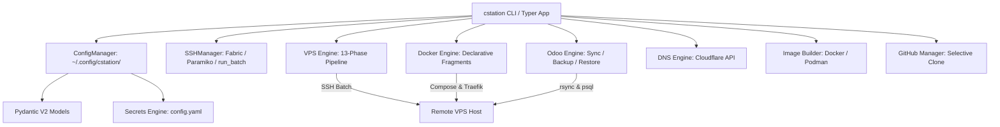

# CStation 🚀

[](https://www.python.org/downloads/)
[](https://docs.astral.sh/uv/)
[](https://hatch.pypa.io/)
[](https://pytest.org/)
[]()

**CStation** is a modern, local-first DevOps CLI and Infrastructure-as-Code (IaC) orchestrator. It manages VPS lifecycle, declarative Docker container stacks, multi-architecture image builds, Cloudflare DNS zones, and end-to-end Odoo deployments with sub-100ms response times.

---

## 📑 Table of Contents

- [Key Highlights](#-key-highlights)
- [System Architecture](#-system-architecture)
- [Installation & Setup](#-installation--setup)
- [Command Hierarchy](#-command-hierarchy)
- [Quickstart Workflows](#-quickstart-workflows)
  - [1. VPS Lifecycle Management](#1-vps-lifecycle-management)
  - [2. Declarative Docker Containers](#2-declarative-docker-containers)
  - [3. Odoo Code Sync & Database Backups](#3-odoo-code-sync--database-backups)
  - [4. Declarative DNS (Cloudflare)](#4-declarative-dns-cloudflare)
  - [5. Multi-Arch Docker Image Builds](#5-multi-arch-docker-image-builds)
  - [6. GitHub Repository Management](#6-github-repository-management)
- [Configuration Structure](#-configuration-structure)
- [Testing & Quality Assurance](#-testing--quality-assurance)
- [Documentation Suite](#-documentation-suite)

---

## ✨ Key Highlights

- **⚡ Blazing Fast Telemetry (<100ms)**: Bundles multi-command SSH queries into single roundtrips using `run_batch()` (`==CS_SEP==` separator) and caches facts in local `.facts.json`.
- **🛡️ 100% Declarative & Safe**: Powered by Pydantic V2 schemas. Every mutating command includes an interactive `plan` mode before `apply`.
- **💻 Local-First Single Source of Truth**: All infrastructure state lives in `~/.config/cstation/` as version-controllable YAML.
- **🐳 Declarative Docker Stacks**: Lightweight fragment files generate production `docker-compose.yml`, `.env`, Traefik reverse-proxy configs, and systemd mounts on-the-fly.
- **🔄 Enterprise Odoo Pipelines**: High-speed delta `rsync` code synchronizers, automated auto-backup extraction with manifest verification, and zero-downtime database + filestore restores.
- **🌐 Cloud-Agnostic with DNS Automation**: Manages Hetzner, Vultr, Netcup, and static bare-metal servers alongside automated Cloudflare DNS ACME challenges.

---

## 🏛️ System Architecture



---

## 📦 Installation & Setup

### Prerequisites
- **Python 3.13+** (pinned via `.python-version`)
- [**`uv`**](https://docs.astral.sh/uv/) (recommended high-performance package manager)

### Installation

```bash
# Clone the repository
git clone https://github.com/lohwswilson/cstation.git
cd cstation

# Install in editable mode with development & test extras
uv pip install -e ".[test]"

# Verify installation
cstation --help
```

---

## 🛠️ Command Hierarchy

```
cstation
├── vps          # VPS lifecycle (init, plan, apply, status, list, ssh, rm)
├── docker       # Declarative container stacks (plan, apply, status, import, rm)
├── odoo         # Odoo workflows (sync, update, backup, restore)
├── image        # Docker image build & registry push (list, build)
├── dns          # DNS zone & record management (zones, plan, apply)
├── github       # GitHub repo & SSH management (repo list, sync, clone, ssh)
├── check        # Offline pre-flight linter & schema validator (alias: lint)
├── completion   # Shell auto-completion helpers (install, show)
├── server       # Server management (ssh-setup, status, ls, rm, playbook, pw sync)
└── version      # Print CStation version
```

---

## 🚀 Quickstart Workflows

### 1. VPS Lifecycle Management

```bash
# Initialize a new VPS via live SSH inspection
cstation vps init sg01.synercatalyst.com --port 22 --user root

# Dry-run 13-phase OS setup (packages, sshd, firewall, swap, tuning, fail2ban, docker)
cstation vps plan sg01.synercatalyst.com

# Apply baseline infrastructure setup
cstation vps apply sg01.synercatalyst.com --yes

# View real-time VPS telemetry dashboard (CPU, RAM, Disk, Docker)
cstation vps status sg01.synercatalyst.com

# List all fleet VPS instances (cached <100ms)
cstation vps list
```

### 2. Declarative Docker Containers

```bash
# Scrape running containers on VPS into local declarative YAML fragments
cstation docker import sg01.synercatalyst.com --all

# Check container state vs declared local state
cstation docker status sg01.synercatalyst.com

# Preview container deployment changes
cstation docker plan sg01.synercatalyst.com

# Deploy / update container stacks over SSH
cstation docker apply sg01.synercatalyst.com --yes
```

### 3. Odoo Code Sync & Database Backups

```bash
# Sync local PW.18.0 and addons to VPS via optimized rsync
cstation odoo sync sg01 18.0

# Preview sync without touching remote files
cstation odoo sync sg01 18.0 --dry-run

# Download the latest auto-backup from a running container
cstation odoo backup us01.synercatalyst.com US01_BESOLUTION_US01DB PW5-BESOLUTION

# Restore a full backup zip (database dump + filestore) to a target VPS
cstation odoo restore sg01.synercatalyst.com SG01_DEV5_SG01DB 2026_08_31_03_00_12.dump.zip --dest-db be5 --yes
```

### 4. Declarative DNS (Cloudflare)

```bash
# List all configured Cloudflare DNS zones
cstation dns zones

# Dry-run DNS drift against ~/.config/cstation/dns/
cstation dns plan synercatalyst.com

# Apply declared DNS records
cstation dns apply synercatalyst.com --yes
```

### 5. Multi-Arch Docker Image Builds

```bash
# List available image recipes in ~/.config/cstation/images/
cstation image list

# Build multi-arch image and push to configured registry
cstation image build synercatalyst-odoo.13.0
```

### 6. GitHub Repository Management

```bash
# View configured repository mappings
cstation github repo list

# Fast selective clone (blobless --filter=blob:none in parallel)
cstation github repo clone

# Sync fork with upstream repository
cstation github repo sync
```

---

## 📂 Configuration Structure

All live configurations reside under `~/.config/cstation/`:

```
~/.config/cstation/
├── config.yaml                     # Global credentials, secrets, & API tokens
├── vps/                            # Server configs & container stacks
│   ├── sg01.synercatalyst.com/
│   │   ├── vps.yaml                # VPS hardware, access & OS baseline
│   │   ├── .facts.json             # Cached hardware & status telemetry
│   │   ├── SG01_DB.yaml            # PostgreSQL database container fragment
│   │   ├── SG01_TRAEFIK.yaml       # Traefik reverse proxy fragment
│   │   ├── SG01_PORTAINER.yaml     # Portainer CE fragment
│   │   └── SG01_DEV8_SG01DB.yaml   # Odoo 18.0 container stack fragment
│   ├── sg07.ansis.com.sg/
│   └── us01.synercatalyst.com/
├── dns/                            # Declarative DNS zones (synercatalyst.com.yaml)
├── github/                         # Git repository sync definitions (odoo_repos.sync.yml)
└── images/                         # Multi-arch Docker image build recipes
```

---

## 🧪 Testing & Quality Assurance

CStation maintains an extensive automated test suite covering CLI invocation, SSH batch execution, model schemas, and error boundaries:

```bash
# Run all tests with pytest
uv run pytest -q

# Run specific test modules
uv run pytest tests/commands/test_docker_cli.py
uv run pytest tests/commands/test_vps_cli.py
uv run pytest tests/commands/test_odoo_cli.py
```

---

## 📚 Documentation Suite

- 🗺️ **[Strategic Roadmap (ROADMAP.md)](ROADMAP.md)**: Phased milestones, tracks, and future capabilities.
- 🏛️ **[System Architecture (ARCHITECTURE.md)](ARCHITECTURE.md)**: Deep dive into CStation internals, SSH batching, and service adapters.
- 📖 **[CLI Command Reference (docs/cli-reference.md)](docs/cli-reference.md)**: Complete manual for all 11 command groups.
- ⚙️ **[Configuration Guide (docs/configuration-guide.md)](docs/configuration-guide.md)**: Comprehensive YAML schema reference.
- 🤝 **[Developer & Contributing Guide (CONTRIBUTING.md)](CONTRIBUTING.md)**: Contribution standards, code style, and PR workflow.
- 🤖 **[AI Agent Guidance (AGENTS.md)](AGENTS.md)**: Canonical rules for AI coding agents.
